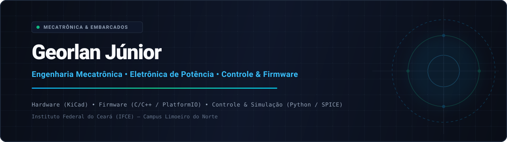
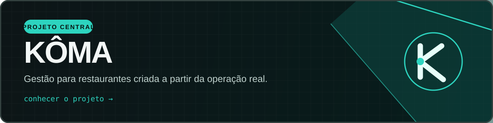

  

  <em>« Tudo é impossível, até ser trivial. »</em>

 

### ⚙️ Sobre o Laboratório

Sou estudante de **Mecatrônica Industrial**, garçom e um construtor obstinado. Divido meus dias entre a operação intensa de restaurante, a bancada de eletrônica e o terminal de código — sempre buscando entender como as coisas funcionam a fundo para depois criar minha própria versão do zero.

Meu trabalho se move no ponto de encontro entre **software, mecânica, eletrônica e matemática**. Não crio projetos por catálogo: crio para resolver problemas reais da minha rotina ou simplesmente para responder à pergunta: *“será que eu consigo fazer isso sozinho?”*

---

### 🏆 Projeto Central

  

> **[Kôma](https://github.com/Georlan/sistema-gourmet-bistro)** é um sistema de gestão e operação para restaurantes nascido da vivência prática. Não foi planejado em uma sala de reuniões corporativa, mas sim construído por quem vive a correria real do salão, do atendimento e da cozinha todos os dias.

---

### 🔬 Bancada de Projetos & Protótipos

<table>
  <tr>
    <td width="33%" valign="top">
      <h4>⚙️ <a href="https://github.com/Georlan/cnc-plotter-28byj48">CNC Plotter 28BYJ-48</a></h4>
      
Máquina CNC projetada e calibrada do zero. Modelagem paramétrica em <strong>OpenSCAD</strong>, controle de motores de passo, cinemática e firmware físico.

    </td>
    <td width="33%" valign="top">
      <h4>🤖 Jarvis Local</h4>
      
Minha exploração prática em <strong>inteligência artificial local</strong>. Um assistente que roda diretamente no hardware, com autonomia, privacidade e automação de rotinas.

    </td>
    <td width="33%" valign="top">
      <h4>☀️ <a href="https://github.com/Georlan/jaguaribe-solar">Jaguaribe Solar</a></h4>
      
Tecnologia e modelagem energética desenvolvidas sob medida para o potencial e a realidade solar do <strong>Vale do Jaguaribe</strong>.

    </td>
  </tr>
</table>

---

### 🏅 Base Científica & Conquistas

A paixão por exatas e experimentação começou muito antes da primeira linha de código:

- 🌌 **OBA (Olimpíada Brasileira de Astronomia e Astronáutica)** — Medalhista e apaixonado por astrofísica e mecânica celeste.
- 📐 **Olimpíadas de Matemática & Ciências** — Trajetória construída no gosto por resolver problemas difíceis e encontrar padrões onde a maioria vê caos.

---

### 💡 Inspirações & Arquétipos

Os personagens e mentes que moldaram minha visão sobre invenção, ciência e persistência:

- **Tony Stark** — O herói dos heróis. Despertou minha admiração pela capacidade de transformar uma oficina em um centro de criação do impossível.
- **Edward Elric** (*Fullmetal Alchemist*) — A prova de que o estudo disciplinado e o domínio dos livros de ciência se transformam em habilidade prática real.
- **Senku Ishigami** (*Dr. STONE*) — A ciência aplicada como a maior arma da humanidade para reconstruir e compreender o mundo passo a passo com 10 bilhões por cento de determinação.
- **Viktor** (*Arcane*) — A recusa absoluta em aceitar limites biológicos ou circunstanciais como definitivos.
- **Ryland Grace** (*Project Hail Mary*) — A demonstração de que raciocínio metódico, trabalho duro e cooperação superam qualquer adversidade em escala cósmica.

---

### 🎮 Lado Gamer & Persistência

- **Completista e focado**: O mesmo foco de buscar 100% das conquistas e zerar desafios difíceis é o que mantém os motores de passo calibrados e o código refinado de madrugada.
- **Favoritos**: *Resident Evil 4*, jogos de progressão intensa, atmosfera de sci-fi e suspense tático.
- 🕹️ [Perfil na Steam](https://steamcommunity.com/) *(discreto, onde os desafios continuam fora da bancada)*

---

  Construído entre código, motores e matemática // Ceará, Brasil 🇧🇷

