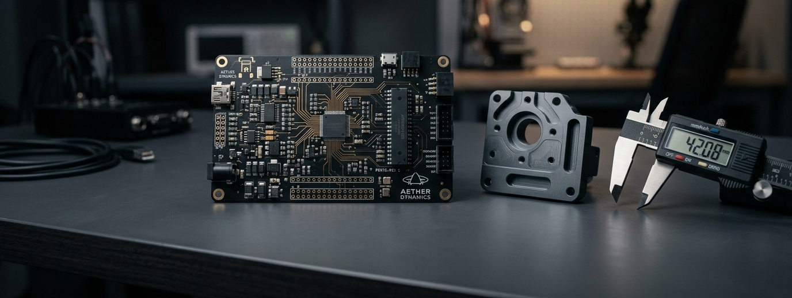

<p align="center">
  
</p>

### Sobre

Graduando em **Tecnologia em Mecatrônica Industrial** no Instituto Federal do Ceará (IFCE - Campus Limoeiro do Norte). 

Desenvolvo projetos integrando as quatro disciplinas fundamentais da mecatrônica: **modelagem matemática/controle**, **eletrônica de potência**, **firmware embarcado (C/C++)** e **desenvolvimento de software**.

---

### 🛠️ Projetos em Destaque

<table>
  <tr>
    <td width="50%" valign="top">
      <h4>⚡ <a href="https://github.com/Georlan/dc-servo-hbridge">dc-servo-hbridge</a></h4>
      <p>Projeto completo de um servoatuador DC com driver em ponte H própria: modelagem analítica e de controle (SymPy/python-control), esquemático e PCB no KiCad, simulação SPICE (Qucs-S/ngspice) e firmware bare-metal em PlatformIO.</p>
      <p><sub><code>C++</code> • <code>KiCad</code> • <code>python-control</code> • <code>ngspice</code> • <code>PlatformIO</code></sub></p>
    </td>
    <td width="50%" valign="top">
      <h4>🦾 <a href="https://github.com/Georlan/cnc-plotter-28byj48">cnc-plotter-28byj48</a></h4>
      <p>Máquina CNC desenvolvida do zero. Modelagem 3D paramétrica, cálculo cinemático de eixos, controle de passo/direção para motores 28BYJ-48 e firmware embarcado para interpolação de trajetórias.</p>
      <p><sub><code>C++</code> • <code>OpenSCAD</code> • <code>Arduino</code> • <code>Cinemática</code></sub></p>
    </td>
  </tr>
  <tr>
    <td width="50%" valign="top">
      <h4>🍽️ <a href="https://github.com/Georlan/sistema-gourmet-bistro">Kôma — Gestão Operacional</a></h4>
      <p>Sistema de alta disponibilidade para automação e controle operacional em gastronomia. Integração entre aplicações de salão/cozinha e agentes locais de hardware/impressão térmica em tempo real.</p>
      <p><sub><code>TypeScript</code> • <code>Python</code> • <code>Next.js</code> • <code>FastAPI</code> • <code>PostgreSQL</code></sub></p>
    </td>
    <td width="50%" valign="top">
      <h4>☀️ <a href="https://github.com/Georlan/jaguaribe-solar">jaguaribe-solar</a></h4>
      <p>Ferramenta computacional e modelagem matemática para dimensionamento, balanço energético e previsão de geração fotovoltaica com base na irradiação solar regional.</p>
      <p><sub><code>Python</code> • <code>NumPy</code> • <code>Modelagem Matemática</code></sub></p>
    </td>
  </tr>
</table>

---

### 💻 Stack Técnica & Habilidades

```text
Eletromecânica & Potência    │ KiCad (Schematic/PCB), Qucs-S, ngspice, Pontes H, Gate Drivers, Fontes Chaveadas
Sistemas Embarcados          │ C, C++, PlatformIO, Arduino, ESP32, STM32, Comunicação Serial (UART/SPI/I2C), PWM
Matemática & Controle        │ Python (NumPy, SciPy, SymPy, python-control, Pandas), OpenModelica, Dinâmica de Sistemas
Mecânica & CAD               │ FreeCAD, CalculiX (FEM), OpenSCAD, Manufatura Aditiva (FDM/3D)
Software & Infraestrutura    │ TypeScript, JavaScript, Python (FastAPI), React, Next.js, PostgreSQL, Linux, Git
```

---

### 🎓 Formação & Conquistas

* **Graduação:** Tecnologia em Mecatrônica Industrial — Instituto Federal de Educação, Ciência e Tecnologia do Ceará (IFCE)
* **Olimpíadas Científicas:**
  * 3× Premiado na **OBA** (Olimpíada Brasileira de Astronomia e Astronáutica)
  * 3× Premiado na **ONC** (Olimpíada Nacional de Ciências)
  * 2× Premiado no **Canguru de Matemática**

---

<p align="center">
  <sub>Georlan Júnior • Limoeiro do Norte, Ceará, Brasil</sub>
</p>
